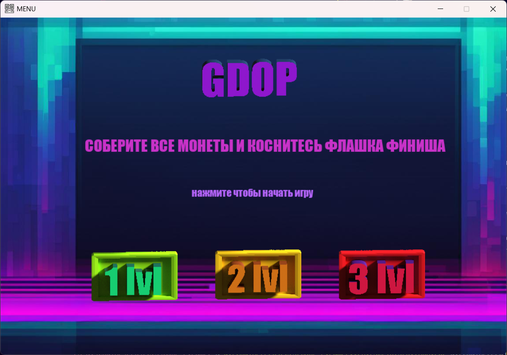
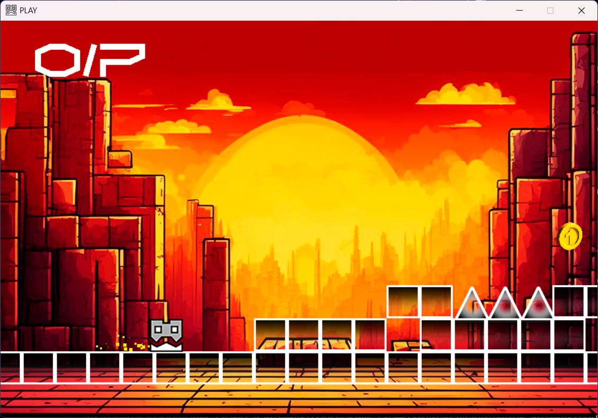

# GDOP - 2D платформер на Python




## Содержание
- [Описание](#описание)
- [Как играть](#как-играть)
- [Установка](#установка)
- [Структура](#структура-проекта)
- [Демонстрация](#демонстрация)
- [Лицензия](#лицензия)

## Описание

**Название игры** — это 2D платформер, разработанный на Python с использованием Pygame. Игроки перемещаются по уровням, собирают монеты, избегают ловушек и достигают финишного флага. Игра включает несколько уровней, увлекательную графику и звуковые эффекты для создания насыщенного игрового опыта.

## Как играть

1. Используйте клавиши стрелок или мышь для управления персонажем.
2. Соберите все монеты на уровне.
3. Достигните финишного флага, чтобы завершить уровень.
4. Избегайте препятствий, таких как шипы и падения за границы экрана.

## Установка

1. Клонируйте репозиторий:
   ```bash
   git clone 'https://github.com/Ivanson-1/GDoP-Pygame.git'
   cd GDoP-Pygame
   ```
2. Установите зависимости:
   ```bash
   pip install -r requirements.txt
   ```
   *(Убедитесь, что у вас установлен Python версии 3.8 или выше.)*

3. Запустите игру:
   ```bash
   python main.py
   ```

## Структура проекта

```
GDoP-Pygame/
├── main.py              # Основная логика игры
├── data/
│   ├── pict/            # Изображения и спрайты
│   ├── sound/           # Звуковые эффекты и музыка
│   ├── font/            # Шрифты, используемые в игре
│   ├── levels/          # Определения уровней
├── requirements.txt     # Зависимости Python
└── README.md            # Документация проекта
```

## Демонстрация

[Посмотрите видео о геймплее на YouTube]([https://youtube.com/](https://youtu.be/b9Ns-1NcNXI?si=YrWe1r0gA5zD_52n))

## Лицензия

Этот проект лицензирован под лицензией MIT. Подробнее см. в файле `LICENSE`.

